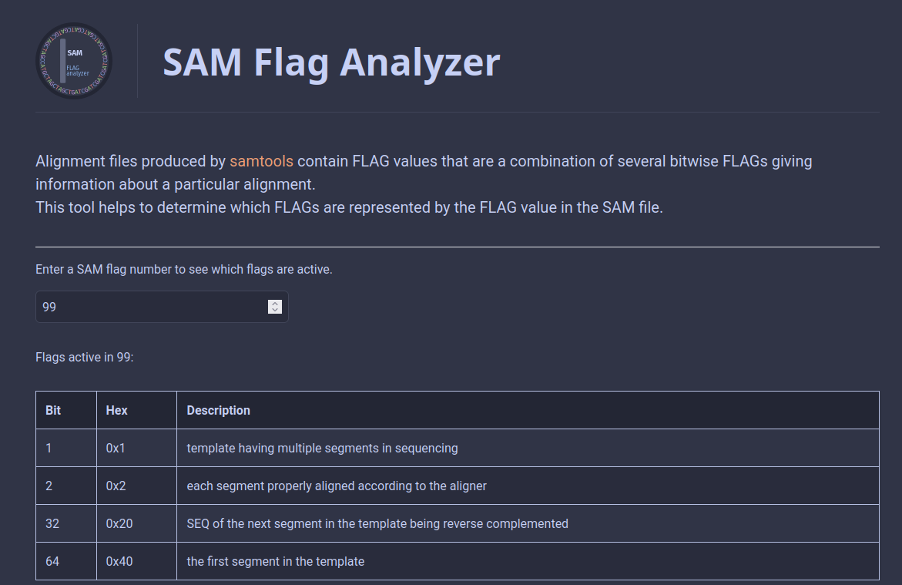

#  SAM Flag Analyzer

A simple, browser-based tool for analyzing SAM (Sequence Alignment/Map) format flags. This tool helps bioinformaticians and researchers quickly decode SAM flag values into their constituent bits and corresponding meanings.

## Features

- Real-time analysis of SAM flag numbers
- Displays all active flags and their descriptions
- Includes a reference table of all possible flags
- Validates flag combinations
- Responsive design for desktop and mobile use

## Demo

Access the live tool: [SAM Flag Analyzer](https://promicrobial.github.io/samflags/)



## Usage

1. Enter a SAM flag number in the input field (e.g., 147)
2. The tool will instantly display:
   - All active flags in the number
   - Their hexadecimal representations
   - Descriptions of what each flag means
   - Warning if flag combination doesn't match input number

Common SAM flag examples:

- `147` = 128 + 16 + 2 + 1 (last segment + reverse complemented + properly aligned + multiple segments)
- `99` = 64 + 32 + 2 + 1 (first segment + next segment reversed + properly aligned + multiple segments)
- `83` = 64 + 16 + 2 + 1 (first segment + reverse complemented + properly aligned + multiple segments)

## Local Usage

Clone the repository and open `index.html` in your browser.

```bash
git clone https://github.com/yourusername/samflags.git
cd samflags
```

## SAM Flag Reference Table

| Bit  | Hex   | Description                                                        |
| ---- | ----- | ------------------------------------------------------------------ |
| 1    | 0x1   | template having multiple segments in sequencing                    |
| 2    | 0x2   | each segment properly aligned according to the aligner             |
| 4    | 0x4   | segment unmapped                                                   |
| 8    | 0x8   | next segment in the template unmapped                              |
| 16   | 0x10  | SEQ being reverse complemented                                     |
| 32   | 0x20  | SEQ of the next segment in the template being reverse complemented |
| 64   | 0x40  | the first segment in the template                                  |
| 128  | 0x80  | the last segment in the template                                   |
| 256  | 0x100 | secondary alignment                                                |
| 512  | 0x200 | not passing filters, such as platform/vendor quality controls      |
| 1024 | 0x400 | PCR or optical duplicate                                           |
| 2048 | 0x800 | supplementary alignment                                            |

The above table was taken from the SAM format [document](https://github.com/samtools/hts-specs/blob/master/SAMv1.pdf). For more details see the file specifications [documentation](https://github.com/samtools/hts-specs) and the samtools [website](https://www.htslib.org/)

## License

This project is licensed under the MIT License - see the LICENSE file for details.
